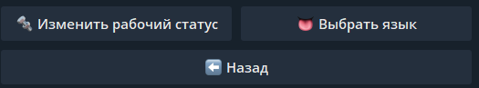

# 🖥 Бот CryptoGrab\_Site


**GitBook tip:** A succinct video overview is a great way to introduce folks to your product. Embed a Loom, Vimeo or YouTube video and you're good to go! We love this video from the fine folks at Loom as a perfect example of a succinct feature overview.


## _Наш бот был разработан для автоматической загрузки дизайнов и подключения ваших доменов на хостинг_.

_Бот поддерживает три языка: русский, английский и испанский._

_В боте существуют две рабочие группы: AFK (отсутствие на рабочем месте) и Work (работа)._ Для избежания блокировки доменов, в режиме AFK все блэкпейджи отключаются.

## _Статус Воркера_

_Всего имеется три статуса работников:_

1. _<mark style="color:blue;">**Newbie**</mark>_<mark style="color:blue;">:</mark> Этот статус присваивается всем пользователям, которые только начинают пользоваться ботом.
2. _<mark style="color:orange;">**Worker:**</mark>_ Рабочим, которые были добавлены в список доступа, присваивается этот статус.
3. _<mark style="color:red;">**Top:**</mark>_ Статус _<mark style="color:red;">**"Top"**</mark>_ присваивается и снимается вручную. Для получения данного статуса в боте необходимо достичь оборота в размере 1000 долларов или более. Если вы достигли данного оборота, вы можете обратиться в [службу поддержки](https://t.me/CryptoGrabSupport\_bot) для установки статуса "Top" в боте.

## _Бесплатный домен_

В нашем боте также доступны домены _<mark style="color:green;">**"Freenom"**</mark>_, которые вы можете получить бесплатно и использовать для тестирования любых функций по вашему желанию. У нас установлен стандартный лимит на количество подобных доменов,со статусом _<mark style="color:orange;">**"Worker"**</mark>_ - 3 штуки, а для статуса _<mark style="color:red;">**"Top"**</mark>_ - 10 штук\


_**Freenom** - это регистратор доменных имен, который предоставляет бесплатные домены верхнего уровня (TLD) для использования в веб-проектах. Они предлагают регистрацию бесплатных доменных имен с расширениями, такими как .ml, .tk, .ga, .cf и .gq._



_Однако важно отметить, что бесплатные домены Freenom имеют некоторые ограничения и ограниченную жизненную цикл домена. Они могут быть отозваны или удалены, если несоблюдаются правила использования, в том числе низкое количество посещений на сайтах или нарушение правил использования Freenom. Поэтому, если вам нужен домен для серьезного веб-проекта или бизнеса, рекомендуется рассмотреть покупку платного домена с более стабильным регистратором._


## _Начало Работы с ботом_

После получения доступа к системе, у вас будет возможность выбрать удобный и понятный для вас язык, а также изменить свой рабочий статус.\
\

<figure><figcaption></figcaption></figure>

Затем вы можете начинать работу с сервисом , можете ознакомиться с панелью управления и посмотреть полезные ссылки \

<figure><figcaption></figcaption></figure>

## _Домены,поддомены и их подключение_&#x20;

Чтобы начать работу, вам необходимо перейти в раздел _<mark style="color:green;">**"Мои Домены"**</mark>_ и затем выбрать опцию _<mark style="color:green;">**"Добавить Новый Домен"**</mark>_. При добавлении домена вам будет предложено выбрать способ подключения - через (1)DNS (NS) или (2)IP. Мы рекомендуем выбрать подключение через DNS (NS), так как оно более правильное простое и удобное. Однако, если у вас нет доступа для изменения NS домена, вы всё равно сможете подключить его через IP.

.png>).png>)\
\
.png>)

Для того, чтобы подключить поддомен, у вас должен быть уже привязан собственный домен. Для одного домена доступно 9 поддоменов.

<figure><figcaption>
🌐 Мои Домены>➕Добавить новый домен>🔩 Создать поддомен
</figcaption></figure>

Чтобы создать поддомен, выбираем опцию _**"**<mark style="color:green;">**Создать поддомен**</mark>**"**_ и отправляем желаемые поддомены в формате:\
_**subdomain1.example.com**_\
_**subdomain2.example.com**_\
_**subdomain3.example.com**_

## ❗️Бесплатные трастовые домены, бесплатные с высоким SEO trust score


[Прелендинги, ссылки через сапорта](https://app.gitbook.com/o/ZViEnMU7N89ipVOKJDEM/s/GDPOUByX8XiizMupMAeF/)


## _**Статья про выбор и покупку домена, чтоб без бана и не дорого.**_


[Выбор Домена|Антиабуз|Оплата в крипто](https://app.gitbook.com/o/ZViEnMU7N89ipVOKJDEM/s/HTe7QW201dNYJK2D7SAb/)



_У вас может возникнуть вопрос о том, где можно приобрести домены. Мы собрали для вас список некоторых из самых популярных и надежных регистраторов, где вы можете осуществить покупку доменов:_

1. _GoDaddy (www.godaddy.com)_
2. _Namecheap (www.namecheap.com)_
3. _Google Domains (domains.google)_
4. _HostGator (www.hostgator.com/domains)_
5. _Bluehost (www.bluehost.com/domains)_
6. _DreamHost (www.dreamhost.com/domains)_
7. _Hover (www.hover.com)_
8. _Gandi (www.gandi.net)_
9. _Domain.com (www.domain.com)_
10. _Porkbun (porkbun.com)_



### После подключения домена, бот будет периодически проверять его на наличие блокировок в антивирусных программах и Metamask'e каждые 4 часа.

_Насчет bitdeftl Детектов: На домены не 1го уровня в боте прилетает "детект" от bitdeftl, 🔥 Детект обнаружен! Это не бан и не детект. На домены которые "свежерег" и не 1й доменной зоны (на дешевые) вешает это. Если перейти по авчек - увидите это Bitdefender TrafficLight spam, untrusted Это НЕ ДЕТЕКТ ! Это расширение от Битдефендера и если оно даже стоит и вы перейдете на домен с этим детектом - оно нечего не напишет и другие антивирусы не подтягивают себе их блек листы так как это не Вирус а просто (недоверенный и спам), изза доменой зоны. Так что если вам прилетело такое - это нечего не меняет!_


***

## _Установка и настройка дизайна_

Независимо от выбранного способа подключения, наш бот предоставит вам подробную инструкцию о том, что делать дальше. После выполнения инструкции вы сможете приступить к выбору дизайна и его установке на ваш домен. Для этого перейдите в раздел _<mark style="color:green;">**"Настроить Домен"**</mark>_ и выберите опцию <mark style="color:green;">**"Установить Новый Дизайн"**</mark>.&#x20;

<figure><figcaption></figcaption></figure>

_<mark style="color:green;">**Защита Блека**</mark>_ <mark style="color:green;"></mark><mark style="color:green;">-</mark> Это [полная защита вашей Black Page](https://read.cryptograb.io/zashita-bleka/) (страницы, на которой установлен наш дизайн и которую вы будете рекламировать). Иногда это используется для прохождения модерации определенных сервисов или применяется в конце работы, чтобы избежать блокировки домена


_**Если вы не подключали клоаку сразу при подключении домена, После подключения Клоаки(Keitaro) Вам необходимо будет переустновить дизайн на ваш домен ,чтобы она включилась и начала работать.**_&#x20;


После переустнановки дизайна с клоакой бот выдаст вам ссылку на личный **кабинет keitaro** ,а также персональный логин и пароль от него.

### _Варианты White Page'a_


_<mark style="color:green;">**Default**</mark>_ _- Для модерации Гугл\ФБ, мы предоставляем наличия многостраничных сайтов на английском языке, которые являются нейтральными по тематике. Некоторые примеры подходящих тематик включают автомобили, психологию, товары "смартфоны", подарки, маркетинг, гаджеты, недвижимость, геологию и т.д._&#x20;

_<mark style="color:green;">**Crypto**</mark> - Всё что касается тематики "крипто", мы ищем сайты, которые специализируются на англоязычных новостях о криптовалютах, гайды по крипто-играм, новости о невзаимозаменяемых токенах (NFT), описания коллекций и другие связанные с этой темой сайты_



### _Также стоит отметить ,что каждый сайт, представленный через бота, является уникальным и имеет правильную структуру файлов для вашего домена, включая файлы sitemap, robots, Terms и Privacy Police_&#x20;


После установки дизайна, бот отправит вам краткое описание о том, где смотреть попытки подключения кошельков и списывания средств (отстук), настраивать сайт и данные клоаки. &#x20;

<figure><figcaption></figcaption></figure>

## Textolite

Когда вы достигаете статуса Топ-воркера, вы получаете возможность редактировать файлы своих веб-сайтов с помощью textolite. После подключения textolite к вашему домену необходимо переустановить дизайн, чтобы установить редактор.&#x20;

.png>).png>)
